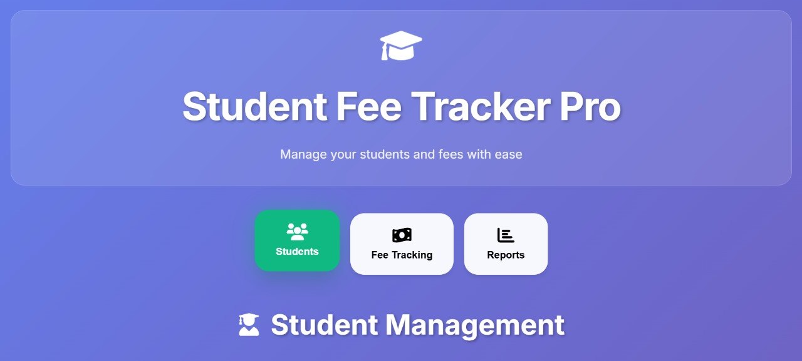
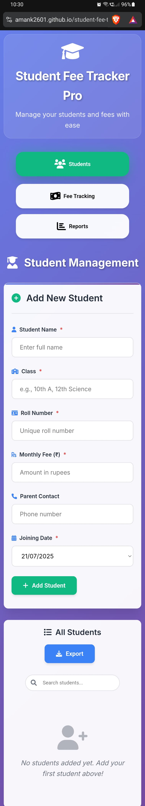
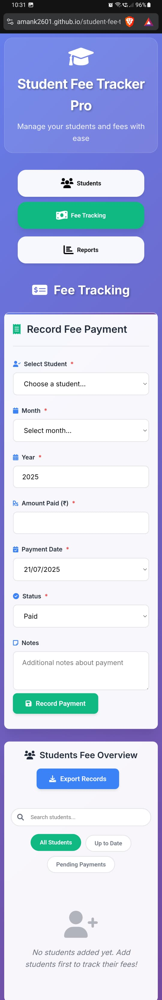

# 🎓 Student Fee Tracker Pro

A modern, responsive web application for managing student fees and payments. Built with vanilla HTML, CSS, and JavaScript - no frameworks required!

## ✨ Features

### 📚 Student Management
- ➕ Add new students with complete details
- ✏️ Edit student information (name, class, roll number, fees, contact)
- 🔍 Real-time search functionality
- 📱 Mobile-responsive student cards
- 📅 Track joining dates and contact information

### 💰 Fee Tracking
- 🎯 **Student-centric fee overview** - Click on any student to see their payment history
- 📊 Monthly payment timeline with visual status indicators
- ✏️ Edit payment records (amount, status, dates, notes)
- 🔄 Real-time status updates (Paid, Pending, Partial)
- 📝 Add payment notes and track modifications
- 🎨 Color-coded payment status (Green: Paid, Red: Pending, Yellow: Partial)

### 📈 Advanced Filtering & Search
- 🔍 Search students by name, class, or roll number
- 🎛️ Filter by payment status (All, Up to Date, Pending)
- 📅 Filter by month, year, and payment status
- ⚡ Real-time filtering with instant results

### 📊 Reports & Analytics
- 📈 Monthly payment summaries
- 📋 Payment status overview with visual charts
- ⚠️ Outstanding fees tracking
- 💹 Comprehensive dashboard with key metrics

### 💾 Data Management
- 💾 Automatic local storage (no server required)
- 📤 Export data (CSV, JSON formats)
- 🗂️ Import/Export all data for backup
- 🔄 Data persistence across browser sessions

### 🎨 Modern UI/UX
- 🌈 Beautiful gradient design with glassmorphism effects
- 📱 Fully responsive (works on phones, tablets, desktops)
- ✨ Smooth animations and transitions
- 🎭 Professional modal dialogs for editing
- 🔔 Toast notifications for user feedback
- 🌙 Clean, modern interface with Font Awesome icons

## 🚀 Live Demo

[**🔗 Try the live demo here**](https://amank2601.github.io/student-fee-tracker-pro/)

## 📱 Screenshots

### Desktop View

Click to view desktop screenshots

### Mobile View

Click to view mobile screenshots

## 🛠️ Installation & Setup

### Option 1: Direct Download
1. Download the ZIP file from this repository
2. Extract the files to your desired location
3. Open `index.html` in any modern web browser
4. Start managing your student fees! 🎉

### Option 2: GitHub Pages (Recommended)
1. **Fork this repository**
2. **Enable GitHub Pages**:
   - Go to Settings → Pages
   - Select "Deploy from a branch"
   - Choose "main" branch
   - Your app will be live at: `https://amank2601.github.io/student-fee-tracker-pro/`

### Option 3: Clone Repository
